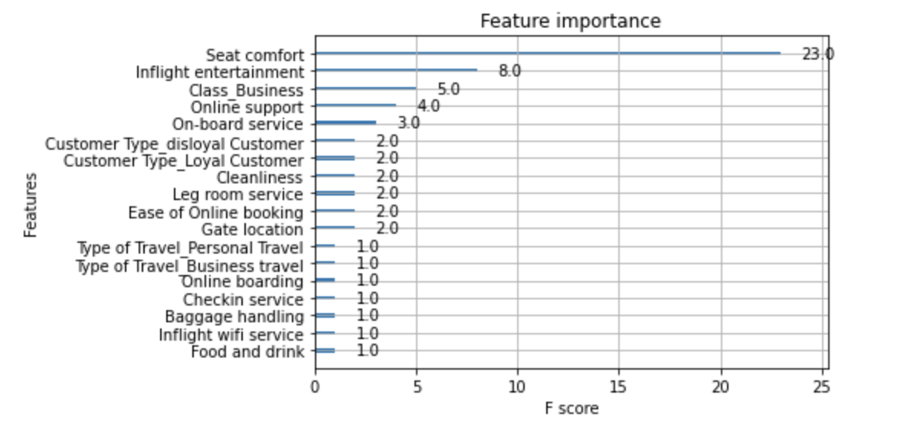

# XGBoost Analysis on Airline Customer Satisfaction

## Project Overview
This project aims to predict customer satisfaction for an airline using an XGBoost model, with an emphasis on identifying key drivers of satisfaction to support data-informed enhancements to customer experience. This analysis builds upon previous work using decision tree and random forest models and evaluates the performance of XGBoost alongside these models. The dataset contains various predictors, including flight class, seat comfort, and in-flight entertainment.

This project involves data preparation, model building, tuning, and evaluation, followed by a comparative analysis of the three models.

## Table of Contents
1. [Introduction](#introduction)
2. [Step 1: Imports](#step-1-imports)
3. [Step 2: Model Preparation](#step-2-model-preparation)
4. [Step 3: Model Building](#step-3-model-building)
5. [Step 4: Results and Evaluation](#step-4-results-and-evaluation)
6. [Conclusion](#conclusion)
7. [Summary for Stakeholders](#summary-for-stakeholders)

## Introduction
The XGBoost model is a powerful extension of decision trees, often excelling in structured data prediction tasks. This project utilizes XGBoost on airline customer satisfaction data, training and tuning the model, and comparing its performance to both decision tree and random forest models. Additionally, feature importance analysis will reveal the most influential factors contributing to customer satisfaction.

## Step 1: Imports
### Importing Packages
Importing several necessary Python libraries:
- `pandas`, `numpy`, and `matplotlib` for data manipulation and visualization.
- Scikit-learn (`sklearn`) for model preparation and evaluation.
- `xgboost` for implementing the XGBoost classifier.

### Loading the Dataset
Loading the airline customer satisfaction data from `Invistico_Airline.csv` into a DataFrame called `airline_data` using `pandas`.

### Displaying the Dataset
Examining the first 10 rows of the data and inspecting the data types for each column to understand the structure and types of variables, identifying potential predictors of satisfaction.

## Step 2: Model Preparation
### Metrics for Evaluation
Before proceeding with modeling, I'll consider which metrics I will ultimately want to leverage to evaluate the model.

- As this is a binary classfication problem, it will be important to evaluate not just `accuracy`, but the balance of false positives and false negatives that the model's predictions provide. Therefore, `precision`, `recall`, and ultimately the `F1 score` will be excellent metrics to use.


### Data Preparation
Converting non-numerical variables into a numeric format suitable for modeling. Isolating the target (`satisfaction`) and predictor variables, and splitting the data into training and test sets (`75% training`, `25% test`) to evaluate generalization.

## Step 3: Model Building
### Instantiating the XGBClassifier

Before fitting the model to the airline dataset, first I'll create the XGB Classifier model and define its objective. I'll use this model to fit and score different hyperparameters during the GridSearch cross-validation process.

### Hyperparameter Tuning
Before fitting the model to the airline dataset, first I'll create the XGB Classifier model and define its objective. I'll use this model to fit and score different hyperparameters during the GridSearch cross-validation process.
- `max_depth`: [4]
- `min_child_weight`: [3]
- `learning_rate`: [0.1]
- `n_estimators`: [5]
- `subsample`: [0.7]
- `colsample_bytree`: [0.7]

Considerations:

If I add just one new option, like changing `max_depth: [4]` to `max_depth: [3, 6]` while keeping everything else the same, I can expect the run time to roughly double. If I include two possibilities for each hyperparameter, the run time could extend to around one hour.    

### Model Evaluation Setup
Defining how the models will be evaluated for hyperparameter tuning. To yield the best understanding of model performance, utilize a suite of metrics.

### Running the GridSearchCV and Fitting the Model
- Constructing the GridSearch cross-validation using the model, parameters, and scoring metrics defined. Additionally, defining the number of folds and specifying F1-score to guide the refit strategy.

- Fitting the GridSearch model to the training data.
- Saving the model for reference using pickle

## Step 4: Results and Evaluation
### Predictions on Test Set
Using the trained model, making predictions on the test set to evaluate its performance.

### Model Performance Metrics Interpretations

1. **Accuracy Score: `0.8731` (`87.31%`)**
   - This means that approximately `87.31%` of the total predictions made by the model were correct. While a high `accuracy` indicates overall performance, it may not fully represent the model's effectiveness, especially in cases of class imbalance.

2. **Precision: `0.8753` (`87.53%`)**
   - This metric indicates that when the model predicts a positive outcome (e.g., customer satisfaction), it is correct about `87.53%` of the time. High `precision` suggests that the model has a low rate of false positives, making it reliable for identifying satisfied customers.

3. **Recall: `0.8957` (`89.57%`)**
   - Recall measures the model's ability to identify all actual positive cases. A `recall` of `89.57%` means that the model correctly identifies about 89.57% of all actual satisfied customers. High `recall` is beneficial as it reduces the risk of missing satisfied customers, which is crucial for retaining customer loyalty.

4. **F1 Score: `0.8854` (`88.54%`)**
   - The `F1 score` is the harmonic mean of precision and recall, balancing both metrics. An F1 score of `88.54%` indicates a strong performance, as it reflects the model’s ability to maintain both high `precision` and high `recall`. This score is particularly useful in scenarios where there is an uneven class distribution, ensuring that both false positives and false negatives are considered in the model evaluation.

### Confusion Matrix Interpretation
The confusion matrix provides a detailed breakdown of the model's predictions compared to the actual outcomes. The following values were obtained:

- **True Positives (TP): `16,000`**
  - This represents the number of satisfied customers that the model correctly predicted as satisfied. A high TP value indicates that the model is effective in identifying customers who are genuinely satisfied.

- **False Positives (FP): `2,300`**
  - This indicates the number of unsatisfied customers that the model incorrectly predicted as satisfied. While a moderate FP count suggests some misclassifications, it's essential to monitor this value as it reflects the model's tendency to overpredict satisfaction.

- **True Negatives (TN): `12,000`**
  - This value signifies the number of unsatisfied customers that the model correctly predicted as unsatisfied. A high TN count demonstrates the model's capability to accurately identify customers who are not satisfied.

- **False Negatives (FN): `1,900`**
  - This indicates the number of satisfied customers that the model incorrectly predicted as unsatisfied. Although this FN count is lower than the FP count, it's important to minimize it to ensure that satisfied customers are not overlooked.

### Key Features
Top predictors of customer satisfaction:
1. `Seat comfort`
2. `Inflight entertainment`
3. `Class_Business`
4. `Online support`



- By a wide margin, "seat comfort" rated as most important in the model.The type of seating is very different between first class and coach seating. However, the perks of being in first class also go beyond the seating type, so perhaps that is an underlying explanation of this feature's importance.

- Surprisingly, delays (both arrival and departure) did not score as highly important.

## Model Comparison
| Model              | F1 Score | Precision | Recall  | Accuracy |
|--------------------|----------|-----------|---------|----------|
| Tuned Decision Tree | 0.945   | 0.955     | 0.936   | 0.941    |
| Tuned Random Forest | 0.947   | 0.951     | 0.945   | 0.943    |
| Tuned XGBoost       | 0.885   | 0.875     | 0.896   | 0.873    |

### Insights
The comparison reveals that the Tuned `Random Forest` model outperforms both the Tuned `Decision Tre`e and Tuned `XGBoost` across all metrics, particularly in `F1 score` `0.947306` and accuracy `0.942450`. The Tuned `Decision Tre`e also shows strong performance with slightly lower values but remains competitive. In contrast, the Tuned` XGBoost` has the lowest scores, which may be attributed to the limited hyperparameter tuning approach, where a narrow range of parameters was used for timely iterations, potentially hindering its performance.

## Conclusion

### Key Insights with Metric Interpretations

1. **Model Performance**: The `Tuned Random Forest` model achieved a remarkable `F1 score of 0.947`, indicating a high balance between precision and recall. The `recall of 0.945` means that the model correctly identifies approximately `94.5%` of satisfied customers, showcasing its effectiveness in capturing true positives. A `precision of 0.950` indicates that when the model predicts a customer is satisfied, it is correct about `95%` of the time. Finally, an `accuracy of 0.942` reflects that about `94.2%` of all predictions made by the model are correct, highlighting its overall reliability.


2. **Confusion Matrix Insights**: The confusion matrix breakdown reveals that the model identified `16,000` satisfied customers `(True Positives)`, which illustrates a strong ability to recognize the majority of satisfied customers. The `12,000 True Negatives` indicate a solid performance in correctly identifying unsatisfied customers. However, the presence of `2,300 False Positives` signifies that some unsatisfied customers were incorrectly classified as satisfied, while `1,900 False Negatives` indicates missed opportunities where satisfied customers were not recognized. The higher True Positive rate suggests that the model is quite effective in recognizing satisfied customers, yet the misclassifications point to areas needing improvement for more accurate predictions.

3. **Key Features Identified**: The analysis highlighted several key features impacting customer satisfaction: 
   - **Seat Comfort**: By a wide margin, this feature rated as the most important in the model. The differences in seating between first class and coach likely explain its significance, as first class offers more than just seating type—additional perks may contribute to overall satisfaction.
   - **Inflight Entertainment**: Another important feature, suggesting that entertainment options play a significant role in the flying experience.
   - **Class_Business**: Indicates that flying business class correlates with higher satisfaction levels.
   - **Online Support**: Highlights the importance of support services in enhancing customer experiences.

   Interestingly, **delays (both arrival and departure)** did not score as highly important, suggesting that factors beyond timeliness significantly influence customer satisfaction.

4. **Comparison with Other Models**: The `Tuned Decision Tree` performed closely to the Random Forest, with an `F1 score of 0.945`. This suggests that it also maintains a good balance between precision and recall, making it a strong contender. In contrast, the `Tuned XGBoost` demonstrated lower metrics, with an `F1 score of 0.885` and `accuracy of 0.873`. This indicates that while the model still performs decently, it is less effective at correctly identifying satisfied customers compared to the other two models. The limited hyperparameter tuning for `XGBoost` likely restricted its optimization, contributing to its lower performance.

### Summary for Stakeholders

- The **Tuned Random Forest** model demonstrates strong performance metrics, with high precision, recall, and accuracy rates. Given its superior performance across multiple metrics, I recommend the Tuned Random Forest model for predicting customer satisfaction. It demonstrates robust accuracy and reliability, making it suitable for operational use. 

- The **Tuned Decision Tree** also presents a strong alternative and could be considered if simpler models are desired for easier interpretability. Meanwhile, the **Tuned XGBoost** model's performance may be improved with more comprehensive hyperparameter tuning, exploring a wider range of parameters could help maximize its predictive capabilities.

- Key features influencing customer satisfaction, particularly **seat comfort**, emphasize the need to focus on enhancing passenger experience through improved seating and entertainment options. Notably, delays were not as impactful on satisfaction scores, indicating that the airline may have opportunities to enhance overall customer experience by addressing other contributing factors.

*These insights provide a roadmap for strategic decisions aimed at improving customer satisfaction and refining model performance for future predictions*


## How to Run
1. **Clone the repository**:

    ```bash
    git clone <https://github.com/MahmoudKhaled98/XGBoost-Analysis-on-Airline-Customer-Satisfaction.git>
    ```

2. **Install dependencies**:
    ```bash
    pip install -r requirements.txt
    ```
3. **Run the notebook**:
    ```bash
    jupyter notebook
    ```

## References

- [XGBClassifier Documentation](https://xgboost.readthedocs.io/en/stable/python/python_api.html)

- [NumPy Documentation](https://numpy.org/doc/stable/)
- [Pandas Documentation](https://pandas.pydata.org/)
- [Scikit-learn Documentation](https://scikit-learn.org/stable/)
  - [train_test_split](https://scikit-learn.org/stable/modules/generated/sklearn.model_selection.train_test_split.html)
  - [GridSearchCV](https://scikit-learn.org/stable/modules/generated/sklearn.model_selection.GridSearchCV.html)
  - [metrics module](https://scikit-learn.org/stable/modules/classes.html#module-sklearn.metrics)
